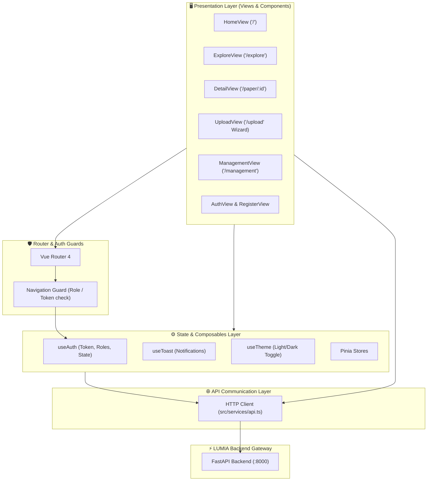

<div align="center">

# 🌐 LUMIA Frontend — Smart Research Discovery & Ingestion Portal

**Next-Generation Academic Research Portal Powered by Vue 3, TypeScript, and Vite**


</div>

---

## 📖 Overview

**LUMIA Frontend** is a modern Single Page Application (SPA) designed for academic research discovery, deep semantic querying, and interactive PDF research paper ingestion. Developed with **Vue 3 (Composition API & `<script setup>`)**, **TypeScript**, and **Vite**, it pairs directly with the [LUMIA BERT-NLP Backend](https://github.com/lowlevelpabi/lumia_retrieval_bert).

The portal offers researchers and students an intuitive gateway to semantic academic paper search, IMRAD-section targeted exploration, live PDF thumbnail rendering, and fine-grained control over document vectorization.

---

## ✨ Core Features

| Feature | Description |
|---|---|
| 🔍 **Deep Semantic & Section Search** | Real-time academic query engine supporting global semantic search as well as explicit IMRAD section filtering (`Introduction`, `Methods`, `Results`, `Discussion`). |
| 🎛️ **Multi-Faceted Academic Filters** | Narrow down repositories by Year Range, University Department, Degree Program, and Project Type. |
| 📑 **Interactive 3-Step Ingestion Wizard** | Guided paper upload flow featuring OCR strategy selection (`Smart Extract` vs `Manual Review`), thumbnail generation, and section mapping. |
| 🖼️ **Page-Level Vectorization Controls** | Inspect extracted text alongside rendered PDF pages and toggle individual pages in and out of vector database indexing. |
| 📄 **Full Paper Detail & Citation Viewer** | Comprehensive metadata display, dynamic citation generators (APA, IEEE, BibTeX), and context-aware recommendation lists. |
| 🛡️ **Role-Based Navigation Guards** | Tailored experiences for `Guest`, `Student`, `Faculty`, and `Admin` users with protected management portals. |
| 🌓 **Adaptive Theme System** | Sleek modern aesthetics supporting dark and light modes with high contrast readability. |

---

## 🏗️ Architecture & Component Flow



For complete technical specifications, view state diagrams, and routing rules, see **[docs/ARCHITECTURE.md](docs/ARCHITECTURE.md)**.

---

## 🧰 Tech Stack

| Category | Technology |
|---|---|
| **Core Framework** | **Vue 3** (`<script setup>`, Composition API) |
| **Language** | **TypeScript 5.9** (Strict Type Checking) |
| **Tooling & Bundler** | **Vite** (Next-gen frontend tooling) |
| **State Management** | **Pinia 3.0** & Composition Stores |
| **Routing** | **Vue Router** with strict authentication/role guards |
| **Icons & UI** | **Lucide Vue Next**, Vanilla scoped CSS variables |
| **PDF Handling** | **jsPDF** & dynamic canvas rendering |
| **Testing** | **Vitest** (Unit tests), **Playwright** (End-to-End tests) |
| **Linter & Formatter** | **ESLint 9**, **oxlint**, **oxfmt** |

---

## 📂 Project Structure

```text
lumia_frontend_sample/
├── src/
│   ├── assets/                      # Global styles, fonts, and icon assets
│   ├── components/                  # Reusable UI primitives (Modals, Cards, Navbars, Filters)
│   ├── composables/                 # Shared logic (useAuth, useToast, useTheme)
│   ├── router/                      # Vue Router route tree and RBAC navigation guards
│   ├── services/                    # API client layer for backend communication
│   ├── stores/                      # Pinia state stores
│   ├── views/                       # Top-level route views
│   │   ├── home_view.vue            # Hero discovery & featured papers
│   │   ├── explore_win.vue          # Semantic search & multi-faceted filtering
│   │   ├── detail_win.vue           # Full paper details, recommendations & citations
│   │   ├── up_win.vue               # 3-Step interactive upload wizard
│   │   ├── manage_win.vue           # Admin & Faculty management portal
│   │   ├── auth_win.vue             # Authentication & login interface
│   │   ├── reg_win.vue              # Registration interface
│   │   ├── profile_win.vue          # User profile & bookmark collection
│   │   └── about_win.vue            # Project documentation & institutional info
│   ├── App.vue                      # Root Vue application shell
│   └── main.ts                      # App initialization & plugin mounting
├── e2e/                             # Playwright end-to-end test suites
├── public/                          # Static web assets
├── playwright.config.ts             # E2E test runner configuration
├── vitest.config.js                 # Unit test configuration
└── package.json                     # Node.js dependencies and scripts
```

---

## 🚀 Getting Started

### 1. Prerequisites
- **Node.js**: `20.19.0` or `>=22.12.0`
- **LUMIA Backend**: Running instance on `http://localhost:8000` (or configure via environment)

### 2. Setup & Installation

```bash
# Clone the repository
git clone https://github.com/lowlevelpabi/lumia_frontend_sample.git
cd lumia_frontend_sample

# Install dependencies
npm install

# Configure environment variables
cp .env.example .env
```

### 3. Development Server

```bash
# Launch Vite dev server
npm run dev
```

The portal will be accessible at: **`http://localhost:5173`**.

### 4. Build & Testing

```bash
# Type check and build for production
npm run build

# Run unit tests
npm run test:unit

# Run end-to-end tests
npm run test:e2e

# Run linter and formatter
npm run lint
npm run format
```

---

## 📚 Documentation Links

- **[UI Walkthrough & Ingestion Guide](docs/FEATURES.md)**
- **[Frontend Architecture & State Design](docs/ARCHITECTURE.md)**

---

<div align="center">

**© LUMIA Academic Information Retrieval Project**

</div>
