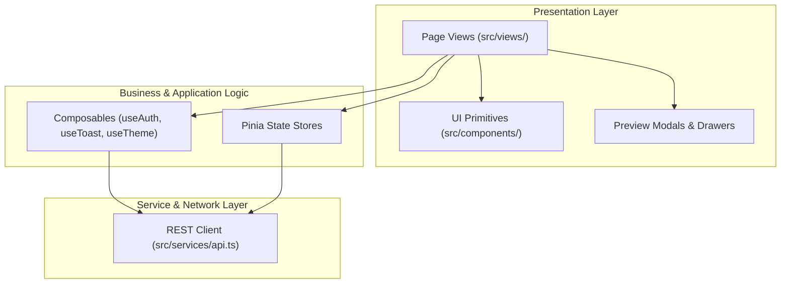

# 🏗️ LUMIA Frontend: Architecture & Technical Deep Dive

Technical architecture, state management patterns, and design principles of the LUMIA frontend application.

[← Back to README](../README.md)

---

## 1. Architectural Patterns

LUMIA Frontend follows clean separation of concerns using Vue 3 modern best practices:



---

## 2. Authentication & Route Guards

Navigation protection is centralized inside `src/router/index.ts`:

```typescript
router.beforeEach((to, _from, next) => {
  const { isLoggedIn, role } = getAuthState()
  const requiresAuth = to.meta.requiresAuth as boolean | undefined
  const requiredRoles = to.meta.requiredRoles as string[] | undefined

  // 1. Unauthenticated access to protected route
  if (requiresAuth && !isLoggedIn) {
    return next({ name: 'login', query: { redirect: to.fullPath } })
  }

  // 2. Insufficient permissions check (e.g., Student trying to access Management)
  if (requiredRoles && !requiredRoles.includes(role)) {
    return next({ name: 'home' })
  }

  // 3. Authenticated user attempting to visit login/register
  if ((to.name === 'login' || to.name === 'register') && isLoggedIn) {
    return next({ name: 'home' })
  }

  next()
})
```

---

## 3. Client State & Composables

### Authentication State (`useAuth.ts`)
- Persists JWT tokens securely in browser storage (`localStorage` / session storage).
- Reactive getters for user identity, role, and expiration validation.
- Automatic header attachment (`Authorization: Bearer <token>`) across API calls.

### Toast Notification System (`useToast.ts`)
- Lightweight reactive notification bus for success, warning, and error messages without third-party UI framework bloat.

### Theme Engine (`useTheme.ts`)
- Manages `data-theme="dark"` / `data-theme="light"` attributes on root HTML element.
- Persists user preferences while honoring system OS `prefers-color-scheme`.

---

## 4. API Communication Layer (`src/services/api.ts`)

Encapsulates all REST requests to the FastAPI backend:

| Function / Method | Endpoint | Description |
|---|---|---|
| `login(credentials)` | `POST /api/v1/auth/login` | Obtains JWT access token |
| `searchPapers(params)` | `GET /api/v1/papers/` | Queries papers with semantic filters |
| `getPaper(id)` | `GET /api/v1/papers/:id` | Fetches complete IMRAD paper model |
| `uploadPaper(formData)` | `POST /api/v1/papers/upload` | Sends PDF multipart for backend extraction |
| `getRecommendations(id)` | `GET /api/v1/papers/:id/recommendations` | Fetches related research papers |

---

[← Features](FEATURES.md) · [Back to README →](../README.md)
