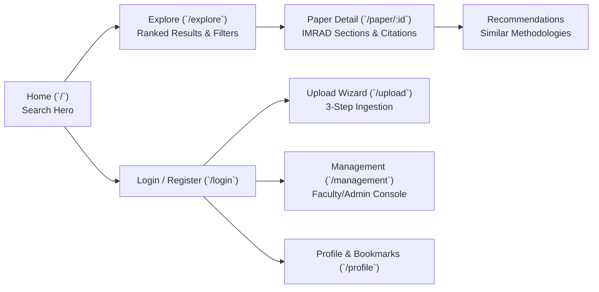

# 📱 LUMIA Frontend: Features & UI Walkthrough

Comprehensive guide to the visual interfaces, user journeys, and ingestion workflows in LUMIA.

[← Back to README](../README.md)

---

## 1. User Journeys & Route Hierarchy



---

## 2. Core Views & Functionality

### 1. Home View (`src/views/home_view.vue`)
- **Central Search Bar**: Real-time query input accepting both natural language questions and precise keywords.
- **Section Dropdown Selector**: Allows selecting target query focus (`All Sections`, `Introduction`, `Methods`, `Results`, `Discussion`).
- **Quick Links**: Department tags and recently bookmarked or trending research papers.

---

### 2. Search & Exploration (`src/views/explore_win.vue`)
- **Ranked Result Cards**: Displays paper title, authors, publication year, department badge, and matching abstract snippet.
- **Similarity & Relevance Score**: Shows AI confidence and cosine relevance percentage.
- **Filter Sidebar**:
  - Year slider / Range selector (e.g., 2020 - 2025).
  - Multi-select department checklist (Computer Science, Engineering, Business, etc.).
  - Academic program and project classification.

---

### 3. Detailed Paper View (`src/views/detail_win.vue`)
- **Interactive IMRAD Accordion / Tabs**: Toggle smoothly between Introduction, Methods, Results, and Discussion.
- **Citation Exporter**: Generates formatted citations for APA 7th Edition, IEEE, and BibTeX format with one-click clipboard copying.
- **AI Recommendation Carousel**: Displays papers sharing high methodological similarity or complementary research outcomes.
- **Full Text / PDF Access**: Direct in-browser viewing and secure PDF download.

---

### 4. Interactive 3-Step Upload Wizard (`src/views/up_win.vue`)

The upload flow guides faculty and researchers through document ingestion:

```text
[Step 1: Upload & Strategy]
  ├── Drop PDF File
  └── Select Parsing Strategy:
        ├── "Smart Extract" (Automated OCR + AI IMRAD detection)
        └── "Manual Review" (Assisted section boundary assignment)

[Step 2: Preview & Vector Control]
  ├── Live Page Thumbnail Grid
  ├── Zoom & Extracted Text Side-by-Side Review
  └── Page Exclusion Toggles (exclude cover pages, blanks, or appendix from embedding)

[Step 3: Verification & Indexing]
  ├── Review Title, Authors, Year, Department, Abstract
  ├── Confirm IMRAD Section Segmentations
  └── Submit for Qdrant Multi-Vector Upsert & SQLite Storage
```

---

### 5. Management Portal (`src/views/manage_win.vue`)
- **Role Protected**: Restricted to `Faculty` and `Admin` accounts via Vue Router navigation guards.
- **Repository Administration**: View submission status, re-run OCR or re-index embeddings, and delete out-of-date records.
- **Audit Log Inspection**: Review search queries and usage patterns.

---

[← System Architecture](ARCHITECTURE.md) · [Back to README →](../README.md)
